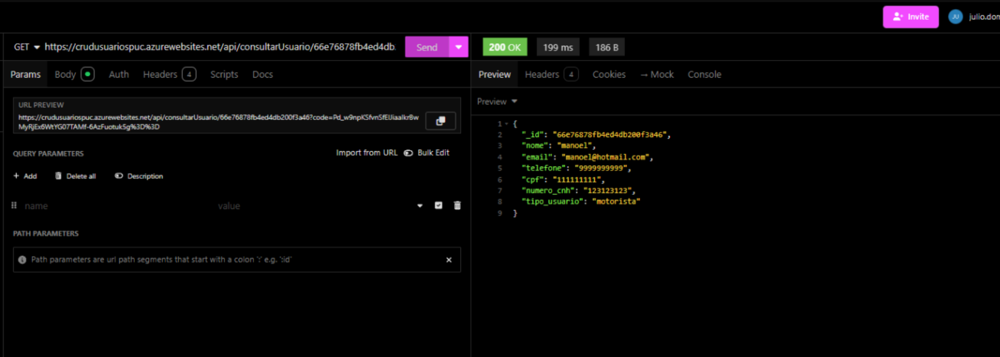
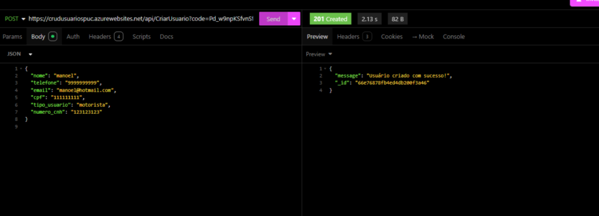
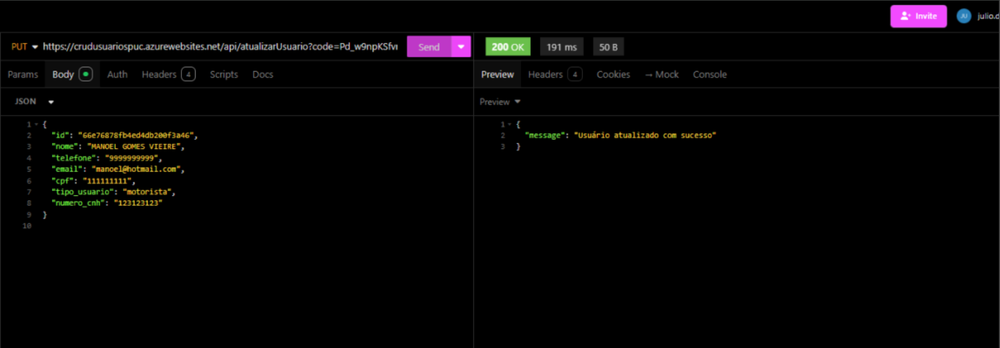
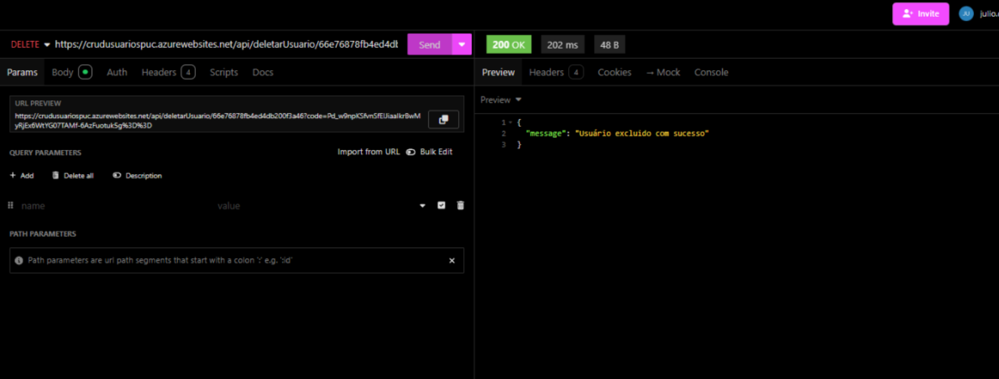
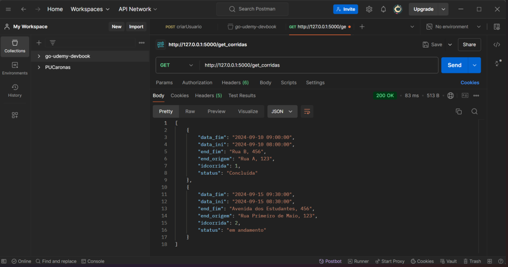
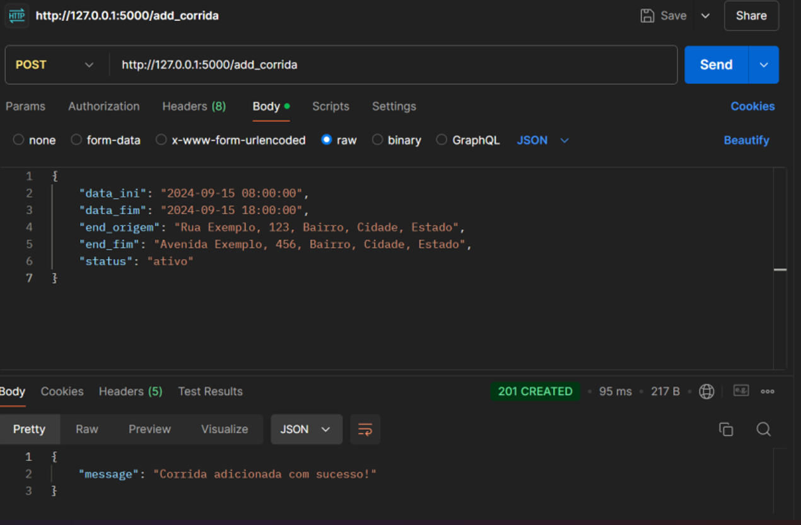
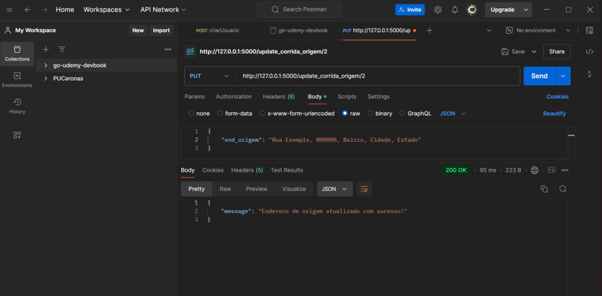
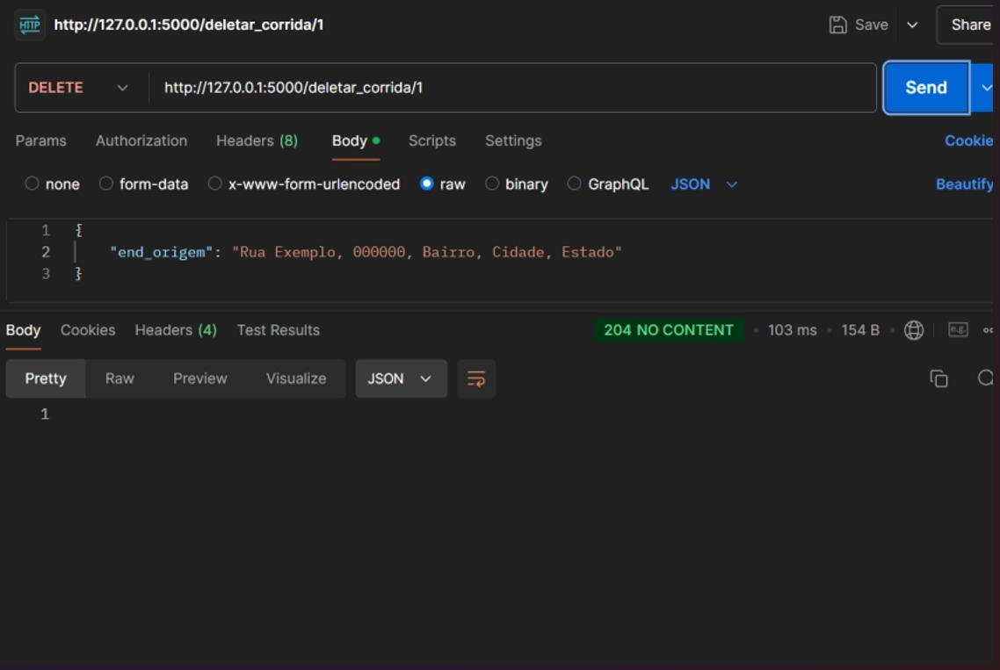
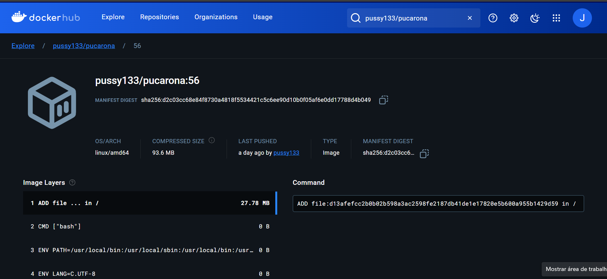
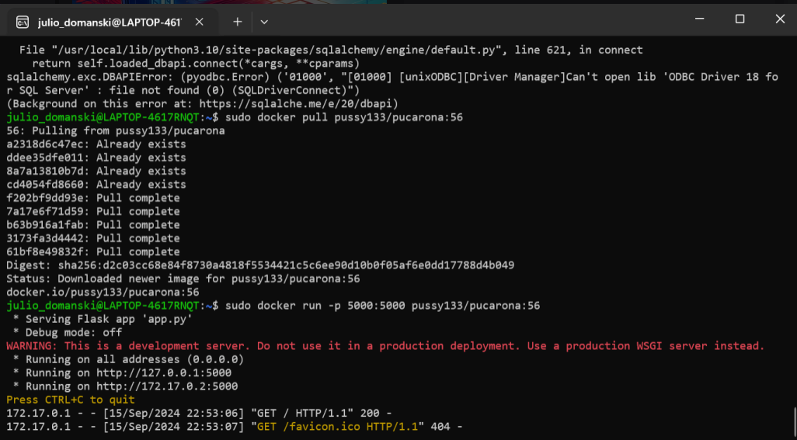


**About arc42**

arc42, the template for documentation of software and system architecture.

Teenter code heremplate Version 8.2 EN. (based upon AsciiDoc version), January 2023

Created, maintained and © by Dr. Peter Hruschka, Dr. Gernot Starke and contributors. See  [https://arc42.org](https://arc42.org/).

This version of the template contains some help and explanations. It is used for familiarization with arc42 and the understanding of the concepts. For documentation of your own system you use better the  _plain_  version.

# Introduction and Goals

O objetivo deste projeto é desenvolver e implementar um aplicativo móvel que simplifique a organização de caronas entre estudantes universitários. A proposta visa promover a mobilidade sustentável e segura dentro das comunidades acadêmicas, incentivando o compartilhamento de veículos entre os alunos. Com funcionalidades intuitivas e de fácil acesso, o aplicativo permitirá que os usuários encontrem e ofereçam caronas de maneira eficiente, contribuindo para a redução do número de veículos em circulação, diminuindo a pegada de carbono e fortalecendo os laços sociais entre os membros da comunidade universitária.

**Link para System Design**
[Sytem Design](https://lucid.app/lucidchart/45490cdb-a854-421d-882d-b4308453c515/edit?viewport_loc=-2625%2C-675%2C4870%2C2126%2C0_0&invitationId=inv_085c1335-7e13-452c-94fc-d7ad48468d4e)

| Prioridade | Objetivos                                           |
|------------|-----------------------------------------------------|
| 1          | O sistema deve ser projetado para ser escalável    |
| 2          | O sistema deve implementar um chat em tempo real  |
| 3          | O sistema deve implementar uma carteira virtual    |
| 4          | O sistema deve implementar geolocalização através de uma API |
| 5          | O sistema deve ser capaz de autenticar alunos      |

## Requirements Overview

| Requisito | Descrição |
|-----------|-----------|
| F1        | Cadastro de usuário: O aplicativo deve permitir que estudantes se cadastrem fornecendo informações pessoais, como nome, foto e matrícula. |
| F1.1      | Cadastro de usuário: O aplicativo deve permitir aos usuários inserir dados adicionais relacionados ao veículo, quando aplicável. |
| F3        | Sistema de avaliação: O aplicativo deve implementar um sistema de avaliação bidirecional entre passageiros e motoristas. |
| F4        | Sistema de geolocalização: O aplicativo deve implementar um sistema de geolocalização para atualizar as posições dos usuários e otimizar rotas de carona. |
| F5        | Sistema de notificações: O aplicativo deve enviar notificações em tempo real para informar os usuários sobre solicitações de carona, confirmações, cancelamentos e atualizações de rota. |

## Quality Goals

| Categoria de Qualidade | Qualidade               | Descrição                                                                 | Cenário |
|------------------------|-------------------------|---------------------------------------------------------------------------|---------|
| Usabilidade            | Facilidade de Uso       | O aplicativo deve ser fácil de navegar tanto para motoristas quanto para passageiros, especialmente em situações de alto tráfego. | SC1     |
|                        | Facilidade de Aprendizado | A interface deve ser intuitiva para novos usuários, exigindo orientação mínima para entender as funcionalidades principais. |         |
| Desempenho             | Precisão                | O rastreamento de localização e as estimativas de viagem devem ser precisas, dentro de uma pequena margem de erro. | SC2     |
|                        | Velocidade & Responsividade | O aplicativo deve carregar e processar solicitações rapidamente, com latência mínima durante os horários de pico. |         |
| Segurança              | Segurança nas Transações | Os processos de pagamento devem ser seguros, garantindo transações seguras para motoristas e passageiros. | SC3     |
| Legal                  | Conformidade Regulamentar | O aplicativo deve aderir às leis locais de transporte e privacidade de dados em todas as regiões de operação. | SC4     |

### Stakeholders

| Nome              | Contato                    | Expectativas |
|-------------------|----------------------------|--------------|
| Gerente de Produto | gerente.produto@gmail.com  | Espera que o aplicativo atenda às necessidades do mercado, seja fácil de usar e proporcione uma boa experiência ao usuário. |
| Equipe de Desenvolvimento | dev.team@gmail.com | Espera que os requisitos sejam claros e bem documentados, e que haja tempo suficiente para implementar funcionalidades. |
| Usuários Finais    | usuarios@gmail.com         | Esperam que o aplicativo seja confiável, rápido, fácil de navegar e atenda às suas necessidades de transporte diário. |
| Motoristas         | motoristas@gmail.com       | Esperam que o aplicativo ofereça um sistema de pagamento justo, suporte eficiente e oportunidades de ganho estáveis. |
| Investidores       | investidores@gmail.com     | Esperam um retorno financeiro positivo. |

# Architecture Constraints

| Categoria               | Restrição                        | Descrição                                                                                                  | Cenário |
|-------------------------|----------------------------------|------------------------------------------------------------------------------------------------------------|---------|
| Plataforma de Nuvem     | Dependência do Azure             | O sistema depende da infraestrutura do Azure, com suas limitações e políticas de serviço.                  | C1      |
| Gerenciamento de Contêineres | Docker & Kubernetes          | A orquestração de contêineres impõe a necessidade de compatibilidade e monitoramento eficiente.            | C2      |
| Armazenamento de Dados  | Banco de Dados MongoDB e SQL     | A arquitetura híbrida deve garantir a consistência entre dados não relacionais e relacionais.               | C3      |
| Monitoramento           | Uso do New Relic                 | Métricas de desempenho e logs serão gerenciados e monitorados pelo New Relic.                               | C4      |
| Escalabilidade          | Replicação e Distribuição        | Os serviços devem ser facilmente escaláveis usando Kubernetes, garantindo alta disponibilidade.             | C5      |
| Alta Disponibilidade    | Chat e Notificações em Tempo Real | O sistema deve garantir alta disponibilidade para suportar comunicação em tempo real e notificações instantâneas.| C6  |
| Segurança               | Autenticação de Estudantes       | O sistema de autenticação deve proteger dados pessoais e estar em conformidade com os padrões de segurança. | C7      |
| Segurança               | Carteira Virtual                 | A segurança financeira e a integridade das transações devem ser garantidas.                                 | C8      |
| Geolocalização          | API de Geolocalização            | Limitações impostas pela API de geolocalização devem ser consideradas para precisão e tratamento de solicitações. | C9   |

# System Scope and Context

## Business Context

| Parceiro de Comunicação | Entradas                                   | Saídas                                |
|-------------------------|-------------------------------------------|---------------------------------------|
| Estudantes (usuários)   | Solicitações de carona, dados de cadastro | Confirmações de carona, notificações  |
| Motoristas (usuários)   | Ofertas de carona, dados de avaliação     | Solicitações de carona, notificações  |
| API de Geolocalização   | Coordenadas de localização                | Rotas otimizadas                      |
| Sistema de Pagamento    | Dados de pagamento                        | Confirmação de transações             |

## Technical Context

**Contents**

| Canal                   | Meio de Transmissão         | Dados de Entrada/Saída                            |
|-------------------------|----------------------------|---------------------------------------------------|
| Aplicativo Móvel        | Conexão de Internet (Wi-Fi/4G/5G) | Solicitações de carona, notificações, pagamentos   |
| Servidor Backend        | HTTP/HTTPS                  | Processamento de requisições, respostas de API    |
| Sistema de Notificações | WebSockets                  | Envio de notificações em tempo real               |
| Banco de Dados          | Conexão de rede (TCP/IP)    | Armazenamento e recuperação de dados do usuário   |

**Diagrama C4 Nivel 1**

[](https://mermaid.live/edit#pako:eNqtU81q20AQfpVhTw6oRrYlS9YtuKH0UAg1uRRBGaSxsqDdVfcn2DF-mD5LX6wjS7brpIceqot2fr5vvpndOYjK1CQKsU7WRnva-VIDf176lmB0wUeJjUUFW2NhjdZohPuuK_WQ-0jWGT0JjmwEpXhy4ddPK00p_rSgNoBdKyv08sXAj0DQcWVgEAQFynhjpfMIJkCHzmFD0pppKe6GIpu986Qm7vTriVkAMH6Q44Zi99cCHVrmsg1q-YoWqiENSHtLEEZRbuC_aQNrJfWJrD-wJIu1sSP_xQUGnOylIBA0ZElXkp0Oas6-oR2Ef3_Y-QmPkqzGdnNpYjNycCOP2KBieWbs5RwaQGNDnTUV8XAsm-d0mDgCTb3_1NTd26H9pfbsTfEH_dJfER8Uyvb_CfhK7fgurhf35PAmPg78mvBpHOdN1jn8foaf-Y3y64TKqH9AzN5DRCQUWW685j049ASl8M-kqBQFH2vaYmh9KUp95FQM3mz2uhKFt4EiYU1onkWxxdaxFboaPY37cvF2qL8Zo84QNkVxEDtRzJNpGi_TVTafxatllswjsRfFhyyZLrIkixd5nsZJkufHSLyeCOLpapHEaZovk5whyWIZCaolL8-XYY9P63z8DapVTJ4)

**Diagrama C4 Nivel 2**
[![](https://mermaid.ink/img/pako:eNqVVc1O20AQfpXVnqiUoiaEOOTGnygSSCkOlypSNdiDWdXedXfXgYDyMFUPSFxRnyAv1tn1D04wh_q0P9_MfDPzjfeJRypGPuHHw2MlLQiJei4ZfVbYFNmJgERDBixG5gDrF4dAw3LQwBQ7zFMRgRUL5RGglYS5LD1MURsldwqDusfm_NoU699aqDlv71isGLw5-VUgy4kRIyNWZCxTVmlhLMUqKKYxkKDQanfOP9VhwqWxmP04UoWMQS93jN-7GF3kDFmyp9LSfU3WO_d4c5jnm3Yl16m6R013pty23PoqCGlRw_p5_cdnU9SZLQQwCQtMIFa6ZPw-6g1EP1HGzm-IeiEI6sgelcdV_KW9U7Jcn1H1ZUSegaXr14SIOLjEZP0aCWUYslulJUbIDqfndZtMq8TmIyYxWLgBgy7KEcjIF-2EuBsWfrsoozeLQ53BI0oK7gEaU6DwEoRhkcoU1YRoZK4of0ks5KiuiumxqGxEj7hmKF1HpYdEd2A3yXWwG3TQu1QyUSc3JbONzRZNCeo91fKKnJ2hSlUEqXgsm_nGZbUlaYgzIb1_tyB5atfiKmRzRONhhNMiUKZJ3TcXy0XskPDpg90htEjDRsJh5YDoncqF8EmfOkilRa-Z9bM_xxqAbUDN4IFEKivFOiToCuf1o6y4JYFs5d3ilcOSmmU7mU0hAXepOkjlWkVIY-vv_cE2uItgbaVb8HbBrjCt_itvU3ttoPT4dTabhk0ODlqDWsN2rLJCuumhSpRmV6fhzA3NhmVj0Z6Oi_ULdRRNpHGBpXGjSN_bDReVWFqx3yTyEeF3YQf_F7fD05awnJqgVkBTg_ByNu0m8q7_5_TXo6fBzdB2FrzHM6TJEzE9LP5fO-f2DjPiPKFljLdQpHbO53JFUCisCpcy4hOrC-xxrYrkjk9uIaVq8yKnEmD1DDWnOcjvSmW1CW355Ik_8MnnvS-7o2AUHPQPgtFoODzo8SWdDgaD3fF4OAj2Bvv9YD8Yrnr80Tvo7_ZH4_4o6I-H43HQ3x8MexxjQa_OZfkw-vdx9Q_ku2io?type=png)](https://mermaid.live/edit#pako:eNqVVc1O20AQfpXVnqiUoiaEOOTGnygSSCkOlypSNdiDWdXedXfXgYDyMFUPSFxRnyAv1tn1D04wh_q0P9_MfDPzjfeJRypGPuHHw2MlLQiJei4ZfVbYFNmJgERDBixG5gDrF4dAw3LQwBQ7zFMRgRUL5RGglYS5LD1MURsldwqDusfm_NoU699aqDlv71isGLw5-VUgy4kRIyNWZCxTVmlhLMUqKKYxkKDQanfOP9VhwqWxmP04UoWMQS93jN-7GF3kDFmyp9LSfU3WO_d4c5jnm3Yl16m6R013pty23PoqCGlRw_p5_cdnU9SZLQQwCQtMIFa6ZPw-6g1EP1HGzm-IeiEI6sgelcdV_KW9U7Jcn1H1ZUSegaXr14SIOLjEZP0aCWUYslulJUbIDqfndZtMq8TmIyYxWLgBgy7KEcjIF-2EuBsWfrsoozeLQ53BI0oK7gEaU6DwEoRhkcoU1YRoZK4of0ks5KiuiumxqGxEj7hmKF1HpYdEd2A3yXWwG3TQu1QyUSc3JbONzRZNCeo91fKKnJ2hSlUEqXgsm_nGZbUlaYgzIb1_tyB5atfiKmRzRONhhNMiUKZJ3TcXy0XskPDpg90htEjDRsJh5YDoncqF8EmfOkilRa-Z9bM_xxqAbUDN4IFEKivFOiToCuf1o6y4JYFs5d3ilcOSmmU7mU0hAXepOkjlWkVIY-vv_cE2uItgbaVb8HbBrjCt_itvU3ttoPT4dTabhk0ODlqDWsN2rLJCuumhSpRmV6fhzA3NhmVj0Z6Oi_ULdRRNpHGBpXGjSN_bDReVWFqx3yTyEeF3YQf_F7fD05awnJqgVkBTg_ByNu0m8q7_5_TXo6fBzdB2FrzHM6TJEzE9LP5fO-f2DjPiPKFljLdQpHbO53JFUCisCpcy4hOrC-xxrYrkjk9uIaVq8yKnEmD1DDWnOcjvSmW1CW355Ik_8MnnvS-7o2AUHPQPgtFoODzo8SWdDgaD3fF4OAj2Bvv9YD8Yrnr80Tvo7_ZH4_4o6I-H43HQ3x8MexxjQa_OZfkw-vdx9Q_ku2io)

**Diagrama C4 Nivel 3**
[![](https://mermaid.ink/img/pako:eNqdV1tu4zYU3Qoh5CMDeAIrtjOpgX4kjjsNMCncOAHawkBBS9cOMRKpIaUkTpDFFPMxCyi6Am-sl6JelKhJWn8YFHV5zuF9kXr2AhGCN_Vm45ngKTymK05IytIIyAWjW0ljSmZjEqNVRCK4x_8RSaikRJCzJGIBTdm9ICGQGZWCU7LIgnygceaIKBPJFPx5LjIeUrk7pElSjgdk5Z3VjyvvHXnWywhZgFSCH2YKpDa6Vdn-L8nEyms-kVAQWkv4kgFJUCbBRSSLUXIqkDpFpRkqVopugUlxhDQWCQ1jxnMpeoALJA2FNFT1FG5X4QDQHUC2IIEHDCcVCdFa1aDmf7nTpocPsMb9mW2WOg3wNdAgNcNL7aQNDQCBo_3fW7Szd9YGd3l1TYPPwMOmZ8_tqYZ3S6BKJ03YR5rCAzUhWVyS4tEo_Cmi6rMZLjBJ8mgD136iJhUkfMmYYvtv-3-g4Ys2Ty0XQ3TPAlBNvUs9t_8mlKW01pild0uzrGmttZxlKcpBb6GAr6KjuXqNDkYUTIonSrIiiSy5FZlkIfSQmTRXHZaPZU6Y9HfjJnQXo5Ye6AXdUv1adNEXUqC7lPZ3aeMk4CJlmzxvBO9h-aUwMdHqMM35PW6CW0ZOquCO9m1khq--4yB820R8WfFWnswf00OsNBaZ5xy-KD5E1wpzmrk2KXZQ0WMLA8lFa1Y3B8h3luMqvbyxx6-iKaihogyYS0c7XG4JjsiVBg2_Vj5wFXdIU7qmCprVctGas4rGyL1Y5w30hq6jPEI4gChXXnbQUvivn4pKkTF9AmzijG8Ejk309QpnuVQ0ulwcNFapvEpClat0Ko4iEg6aThw6THmP1qbYs7hqbKuKiZNSJ6qD7wq4Pkt4L11cGiCfCLBL2oGuon3OriEqDrn6qLjFXNHOKU8F6ywwTD_f3CyWBaQBKZfbndzUstWdi-Nnvrwh2OcLDI3QXNnqtXUDzayD-BWUVhNtN8g3YXQbpqOe3oTU0xld7a4Xz4nRalT9gMurm0UDrL21Tqvp3Wkd_hLL5FDL4fnFAvOQBCKunV47x9x7Wme_48LTR2plidVp8CqpsijND9xODWaO5lOJsrZgtZXvYgadTvOam9-Gm7haSwVtnYBWs3CBxo62UXjzNsEWD_MIcqXpLoIiogcbvG_NRCTkjytPQqiXHqy35cxWws5MCRmCtAzf1cCotQla9ooDfd0v16yjDHKoiHHoTIrNRkH6G05N3Miu_vOf8X_Hqff-0M3weu39P77xsLXD95MeBa8UrEVfxqrJXs61qCw5x8NWUnyiO5EhLN-w7eFBMF7e0QQu-bV4QOtRvjoYl5eAct4vQLyBFwPmHwvxCy-_Hay89A6zbOVNcYhL8G624i9opy_Gyx0PvGkqMxh4UmTbO2-6oZHCpyzXUnwQVrMJ5X8IEZdL8NGbPnuP3tQf-kfHJ8ejyQ-TyXBy4p-OBt7Om46Oj8anI398Mjz5MPYnH0YvA-8pB_CPhubnn5z6o9HIPx54EDK8q1-Zz9P8K_XlX-lxACY?type=png)](https://mermaid.live/edit#pako:eNqdV1tu4zYU3Qoh5CMDeAIrtjOpgX4kjjsNMCncOAHawkBBS9cOMRKpIaUkTpDFFPMxCyi6Am-sl6JelKhJWn8YFHV5zuF9kXr2AhGCN_Vm45ngKTymK05IytIIyAWjW0ljSmZjEqNVRCK4x_8RSaikRJCzJGIBTdm9ICGQGZWCU7LIgnygceaIKBPJFPx5LjIeUrk7pElSjgdk5Z3VjyvvHXnWywhZgFSCH2YKpDa6Vdn-L8nEyms-kVAQWkv4kgFJUCbBRSSLUXIqkDpFpRkqVopugUlxhDQWCQ1jxnMpeoALJA2FNFT1FG5X4QDQHUC2IIEHDCcVCdFa1aDmf7nTpocPsMb9mW2WOg3wNdAgNcNL7aQNDQCBo_3fW7Szd9YGd3l1TYPPwMOmZ8_tqYZ3S6BKJ03YR5rCAzUhWVyS4tEo_Cmi6rMZLjBJ8mgD136iJhUkfMmYYvtv-3-g4Ys2Ty0XQ3TPAlBNvUs9t_8mlKW01pild0uzrGmttZxlKcpBb6GAr6KjuXqNDkYUTIonSrIiiSy5FZlkIfSQmTRXHZaPZU6Y9HfjJnQXo5Ye6AXdUv1adNEXUqC7lPZ3aeMk4CJlmzxvBO9h-aUwMdHqMM35PW6CW0ZOquCO9m1khq--4yB820R8WfFWnswf00OsNBaZ5xy-KD5E1wpzmrk2KXZQ0WMLA8lFa1Y3B8h3luMqvbyxx6-iKaihogyYS0c7XG4JjsiVBg2_Vj5wFXdIU7qmCprVctGas4rGyL1Y5w30hq6jPEI4gChXXnbQUvivn4pKkTF9AmzijG8Ejk309QpnuVQ0ulwcNFapvEpClat0Ko4iEg6aThw6THmP1qbYs7hqbKuKiZNSJ6qD7wq4Pkt4L11cGiCfCLBL2oGuon3OriEqDrn6qLjFXNHOKU8F6ywwTD_f3CyWBaQBKZfbndzUstWdi-Nnvrwh2OcLDI3QXNnqtXUDzayD-BWUVhNtN8g3YXQbpqOe3oTU0xld7a4Xz4nRalT9gMurm0UDrL21Tqvp3Wkd_hLL5FDL4fnFAvOQBCKunV47x9x7Wme_48LTR2plidVp8CqpsijND9xODWaO5lOJsrZgtZXvYgadTvOam9-Gm7haSwVtnYBWs3CBxo62UXjzNsEWD_MIcqXpLoIiogcbvG_NRCTkjytPQqiXHqy35cxWws5MCRmCtAzf1cCotQla9ooDfd0v16yjDHKoiHHoTIrNRkH6G05N3Miu_vOf8X_Hqff-0M3weu39P77xsLXD95MeBa8UrEVfxqrJXs61qCw5x8NWUnyiO5EhLN-w7eFBMF7e0QQu-bV4QOtRvjoYl5eAct4vQLyBFwPmHwvxCy-_Hay89A6zbOVNcYhL8G624i9opy_Gyx0PvGkqMxh4UmTbO2-6oZHCpyzXUnwQVrMJ5X8IEZdL8NGbPnuP3tQf-kfHJ8ejyQ-TyXBy4p-OBt7Om46Oj8anI398Mjz5MPYnH0YvA-8pB_CPhubnn5z6o9HIPx54EDK8q1-Zz9P8K_XlX-lxACY)

# Solution Strategy

- Decisões Tecnológicas:
    - Uso de Kubernetes para escalabilidade.
    - Implementação de microserviços para modularidade.
    - Adoção de MongoDB para armazenamento de dados não relacionais e SQL para relacionais.

- Padrões Arquiteturais:
    - Arquitetura baseada em microserviços para facilitar a escalabilidade e manutenção.
    - Uso de contêineres Docker para garantir a consistência dos ambientes de desenvolvimento e produção.

- Estratégias para Metas de Qualidade:
    - Implementação de um sistema de cache para melhorar a responsividade.
    - Uso de APIs de geolocalização otimizadas para garantir a precisão.
    - Adoção de práticas de segurança como OAuth2 para autenticação de usuários e proteção de dados.

# Building Block View

**Content**

The building block view shows the static decomposition of the system into building blocks (modules, components, subsystems, classes, interfaces, packages, libraries, frameworks, layers, partitions, tiers, functions, macros, operations, data structures, …) as well as their dependencies (relationships, associations, …)

This view is mandatory for every architecture documentation. In analogy to a house this is the  _floor plan_.

**Motivation**

Maintain an overview of your source code by making its structure understandable through abstraction.

This allows you to communicate with your stakeholder on an abstract level without disclosing implementation details.

**Form**

The building block view is a hierarchical collection of black boxes and white boxes (see figure below) and their descriptions.

**Level 1**  is the white box description of the overall system together with black box descriptions of all contained building blocks.

**Level 2**  zooms into some building blocks of level 1. Thus it contains the white box description of selected building blocks of level 1, together with black box descriptions of their internal building blocks.

**Level 3**  zooms into selected building blocks of level 2, and so on.

See  [Building Block View](https://docs.arc42.org/section-5/)  in the arc42 documentation.

## Whitebox Overall System

Here you describe the decomposition of the overall system using the following white box template. It contains

-   an overview diagram
    
-   a motivation for the decomposition
    
-   black box descriptions of the contained building blocks. For these we offer you alternatives:
    
    -   use  _one_  table for a short and pragmatic overview of all contained building blocks and their interfaces
        
    -   use a list of black box descriptions of the building blocks according to the black box template (see below). Depending on your choice of tool this list could be sub-chapters (in text files), sub-pages (in a Wiki) or nested elements (in a modeling tool).
        
-   (optional:) important interfaces, that are not explained in the black box templates of a building block, but are very important for understanding the white box. Since there are so many ways to specify interfaces why do not provide a specific template for them. In the worst case you have to specify and describe syntax, semantics, protocols, error handling, restrictions, versions, qualities, necessary compatibilities and many things more. In the best case you will get away with examples or simple signatures.
    

_**<Overview Diagram>**_

Motivation  
_<text explanation>_

Contained Building Blocks  
_<Description of contained building block (black boxes)>_

Important Interfaces  
_<Description of important interfaces>_

Insert your explanations of black boxes from level 1:

If you use tabular form you will only describe your black boxes with name and responsibility according to the following schema:

**Name**

**Responsibility**

_<black box 1>_

_<Text>_

_<black box 2>_

_<Text>_

If you use a list of black box descriptions then you fill in a separate black box template for every important building block . Its headline is the name of the black box.

### <Name black box 1>

Here you describe <black box 1> according the the following black box template:

-   Purpose/Responsibility
    
-   Interface(s), when they are not extracted as separate paragraphs. This interfaces may include qualities and performance characteristics.
    
-   (Optional) Quality-/Performance characteristics of the black box, e.g.availability, run time behavior, ….
    
-   (Optional) directory/file location
    
-   (Optional) Fulfilled requirements (if you need traceability to requirements).
    
-   (Optional) Open issues/problems/risks
    

_<Purpose/Responsibility>_

_<Interface(s)>_

_<(Optional) Quality/Performance Characteristics>_

_<(Optional) Directory/File Location>_

_<(Optional) Fulfilled Requirements>_

_<(optional) Open Issues/Problems/Risks>_

### <Name black box 2>

_<black box template>_

### <Name black box n>

_<black box template>_

### <Name interface 1>

…

### <Name interface m>

## Level 2

Here you can specify the inner structure of (some) building blocks from level 1 as white boxes.

You have to decide which building blocks of your system are important enough to justify such a detailed description. Please prefer relevance over completeness. Specify important, surprising, risky, complex or volatile building blocks. Leave out normal, simple, boring or standardized parts of your system

### White Box  _<building block 1>_

…describes the internal structure of  _building block 1_.

_<white box template>_

### White Box  _<building block 2>_

_<white box template>_

…

### White Box  _<building block m>_

_<white box template>_

## Level 3

Here you can specify the inner structure of (some) building blocks from level 2 as white boxes.

When you need more detailed levels of your architecture please copy this part of arc42 for additional levels.

### White Box <_building block x.1_>

Specifies the internal structure of  _building block x.1_.

_<white box template>_

### White Box <_building block x.2_>

_<white box template>_

### White Box <_building block y.1_>

_<white box template>_

# Runtime View

**Contents**

The runtime view describes concrete behavior and interactions of the system’s building blocks in form of scenarios from the following areas:

-   important use cases or features: how do building blocks execute them?
    
-   interactions at critical external interfaces: how do building blocks cooperate with users and neighboring systems?
    
-   operation and administration: launch, start-up, stop
    
-   error and exception scenarios
    

Remark: The main criterion for the choice of possible scenarios (sequences, workflows) is their  **architectural relevance**. It is  **not**  important to describe a large number of scenarios. You should rather document a representative selection.

**Motivation**

You should understand how (instances of) building blocks of your system perform their job and communicate at runtime. You will mainly capture scenarios in your documentation to communicate your architecture to stakeholders that are less willing or able to read and understand the static models (building block view, deployment view).

**Form**

There are many notations for describing scenarios, e.g.

-   numbered list of steps (in natural language)
    
-   activity diagrams or flow charts
    
-   sequence diagrams
    
-   BPMN or EPCs (event process chains)
    
-   state machines
    
-   …
    

See  [Runtime View](https://docs.arc42.org/section-6/)  in the arc42 documentation.

## <Runtime Scenario 1>

-   _<insert runtime diagram or textual description of the scenario>_
    
-   _<insert description of the notable aspects of the interactions between the building block instances depicted in this diagram.>_
    

## <Runtime Scenario 2>

## …

## <Runtime Scenario n>

# Deployment View
[](https://mermaid.live/edit#pako:eNp1U01TwyAQ_SsM57YH9ZSDM01jx4M61eZmHAcJbRgTiASisdP_7hJSG5KGC_D27ddjOWAqU4YDvFekzFAcJgLBqsyHAyJWMVHLvOYFE1o6q11E0Zur1wS3e4LfzpaNoURJQcB4Onr2XU6qz_fqKyc5zVjRAG8Iefy1NQKp3f1MvLRJeOmjjc6kuH4xQkPRluAA1CEeecoNzee3Nv6gjDE8LH3MOIngLF4WR2IiTcRA9-WvUWwc4-6HUehoWfotPzbb5wfA292ztHHWRlDNpaisqwXQ7oRMidHLB3WjeLVpy3cJJmn3cex4ftrpNqNwy1TNVK8VKfYyCm0z7vRf4SX_Vc5hLHtCdcATDDWECJX8riD6hRDt3KL5AiUYZpwqVsNgoIV9ol5Tjnt-QUtfyaLkOUklSqddfAE8Cbu2RK9cT7thMDzDBVMF4Sl804NFEqxh1CB5AMeUKPgViTgCjxgtt42gONDKsBlW0uwzHOxIXsHNlCnRLOIEtCs69PgHQJk71g)

| Nó | Descrição                                   
|-------------------------|-------------------------------------------|
| Desenvolvimento   | Ambiente de desenvolvimento do PUCARONA | 
| Azure   | Fornecedor de Cloud     | 
| Cliente   | Computador/Celular do usuário                | 
| DB server    | Servidor de banco de dados MongoDB Atlas                       | 

# Cross-cutting Concepts

**Content**

| Conceitos | Descrição |
|-----------|-----------|
| Autenticação e Autorização     | Tanto motoristas quanto passageiros precisam de autenticação para acessar suas funcionalidades específicas (motoristas oferecendo caronas, passageiros solicitando). Um sistema robusto de autorização deve garantir que apenas os usuários corretos tenham acesso a determinadas informações. |
| Proteção de Dados Pessoais     | Como haverá troca de dados sensíveis (informações de contato, rotas de viagem), é crucial garantir que todas as informações estejam protegidas por criptografia (em trânsito e em repouso). |
| Regulamentação       | A conformidade com leis de proteção de dados, como a LGPD (Lei Geral de Proteção de Dados), deve ser um conceito transversal a todo o sistema. |
| Persistência      | A aplicação deve armazenar informações de usuários (passageiros e motoristas), além de dados sobre as caronas oferecidas e aceitas. É importante definir onde e como esses dados serão armazenados de maneira eficiente e segura |
| Auditabilidade        | Manter registros de transações, como histórico de caronas e trocas de mensagens entre passageiross e motoristas, pode ser necessário para garantir transparência e segurança. |
| Monitoramento       | Monitorar o uso do sistema, especialmente em tempo real, para detectar possíveis falhas, tentativas de acesso não autorizado ou comportamento incomum. |
| Comunicação por chat       |Pode ser necessário um sistema de notificação para avisar motoristas e passageiross sobre caronas confirmadas, cancelamentos, etc. Esse conceito pode afetar diferentes partes do sistema, como o backend, que enviará notificações para aplicativos móveis ou via SMS/email. |
| Concorrência de Acessos       | Como o sistema pode ter várias pessoas requisitando ou oferecendo caronas ao mesmo tempo, é fundamental garantir que o sistema lide bem com a concorrência. Situações como dois usuários aceitando a mesma carona simultaneamente precisam ser prevenidas ou resolvidas adequadamente. |

# Architecture Decisions

[](https://mermaid.live/edit#pako:eNqlVd1u2jAYfRUr1ykCAiXNxaRAoGtXWrYgVVrgwk2-gtXEpraD-qM-TLWLSrud9gR5sX1JoG3CxCoNcRHnO8c-xz6f82iEIgLDMRaSrpZk6s04wZ8beBAylf0GRVx5mzINOpWUqTk5OPhE-sGYhVIokGuWvQg137CK4iDoUx4KEgHxaCQUORf-17MKxAvcVAPXLKTZS_ZDkAscL0m70azAhsExiFiENGYPG-CaUeJOTiqwUTAGrugCJBYhIVNIVoJ8AxpXYMfBUOFU9IrFLKKoLhQJ-ZJegeSgIfdQovulxVZwmirNrlGjZmvqkBobyJjy3EUhbF7htgM31jhvwVQOGQsuYqaFSfwLtwq1goHgCm7T7CcPWQ6eCMUKHjmorWmSc1jQbW0gklUMd0XlVfygPIId8aMc-aod_0N1m0JC5xVaXTeem0kGVCnKI1nD_o9wrtJY4_PGAn3bfK_Mx45-HxaYP9xrapIzsWCc-AJX3Z7whlbX36eKhSTPlklOL6dV8H4DWNNSxMVeuSEoJT6w-8MytjvqMbGYShkCw6bJp75m2fMatuo3tLr6k3yFBNtkk_2JzH6tMONV1n4bIxq-O_QTrgEbvZiuZgcFi7djGJWNtWMEXaf8tWv_1msbZt3L5-l0gsLimPGFSUZMwhVVUOXsd9Kn7I6SM6rLalX--1bMjfp4YGVXlisclzfAv3oakyKS7Dm_l-YVYt2OJ8IbkEUI8BY0iXvpk-HAr5L2-8EJKfGYWgnOPtTghmkkIBPKIryuH_OVZoZeYkBmhoOPEZU3M2PGnxBH0Yd_z0PD0TIF05AiXSy3g3QVUQ0eo5iEZPtyRfl3Id4PDefRuDOcTrfX6Np2s9Vp9jp2r3VkGveG0zts2Fbbsjs92zq07KPOk2k8FPxWo2X3ulbL6rabHavVzQkQ4d0nx-WHpvjePP0B_VMs0g)

# Quality Requirements

1. **Desempenho**
   - O sistema deve responder às requisições de busca de caronas em menos de 2 segundos.
   - Métrica: Tempo de resposta abaixo de 2 segundos em 95% das requisições.

2. **Escalabilidade**
   - O sistema deve suportar até 100.000 usuários simultâneos.
   - Métrica: Escalabilidade automática via Kubernetes.

3. **Segurança**
   - Todas as comunicações devem ser criptografadas (SSL/TLS).
   - Métrica: 100% das comunicações via HTTPS.

4. **Disponibilidade**
   - O sistema deve ter 99,9% de disponibilidade.
   - Métrica: O tempo de inatividade não deve exceder 43 minutos por mês.

5. **Usabilidade**
   - O cadastro de novos usuários deve ser completado em menos de 3 minutos.
   - Métrica: 95% dos usuários concluem o cadastro em até 3 minutos.

6. **Compatibilidade**
   - O sistema deve ser compatível com as versões mais recentes dos principais navegadores e aplicativos móveis.
   - Métrica: Compatibilidade com as versões mais recentes de Chrome, Firefox, Safari, Android e iOS.

7. **Manutenibilidade**
   - O sistema deve permitir a adição de novas funcionalidades com impacto mínimo.
   - Métrica: Tempo de introdução de novas funcionalidades não excede 2 semanas.

# Evidencias
**Azure Functions**

[Link Function GET](https://crudusuariospuc.azurewebsites.net/api/consultarUsuario/66e1f61e26072be9dd0b3430?code=Pd_w9npKSfvnSfEIJiaaIkrBwMyRjEx6WtYG07TAMf-6AzFuotuk5g%3D%3D)

[Link Function POST](https://crudusuariospuc.azurewebsites.net/api/CriarUsuario?code=Pd_w9npKSfvnSfEIJiaaIkrBwMyRjEx6WtYG07TAMf-6AzFuotuk5g%3D%3D)

[Link Function PUT](https://crudusuariospuc.azurewebsites.net/api/atualizarUsuario?code=Pd_w9npKSfvnSfEIJiaaIkrBwMyRjEx6WtYG07TAMf-6AzFuotuk5g%3D%3D)

[Link Function DELETE](https://crudusuariospuc.azurewebsites.net/api/deletarUsuario/%7Buser_id%7D?code=Pd_w9npKSfvnSfEIJiaaIkrBwMyRjEx6WtYG07TAMf-6AzFuotuk5g%3D%3D)

**Link para o repositorio**
[Repositorio do codigo Azure Functions](https://github.com/JulioDomanski/PUCaronasFunctions)

**BackEnd**

**Link para o repositorio**
[Repositorio do codigo BackEnd](https://github.com/Cyrilzak02/PJBL-PUCARONA/tree/main/PUCarona-1)

**Docker**

**Link para o repositorio**
[Docker Hub](https://hub.docker.com/layers/pussy133/pucarona/56/images/sha256-d2c03cc68e84f8730a4818f5534421c5c6ee90d10b0f05af6e0dd17788d4b049?context=explore)

# Risks and Technical Debts

| **Risco**                        | **Descrição**                                                                                             |
|----------------------------------|-----------------------------------------------------------------------------------------------------------|
| **Complexidade de Manutenção**   | A utilização de múltiplos microserviços pode aumentar a complexidade de manutenção e depuração do sistema. |
| **Latência de Comunicação**      | A comunicação entre microserviços pode introduzir latência adicional, impactando o desempenho geral.     |
| **Gerenciamento de Estado**      | Manter o estado consistente entre microserviços pode ser desafiador e propenso a erros.                  |
| **Consistência de Dados**        | Garantir a consistência dos dados entre os microserviços pode ser complicado e exigir sincronização adicional. |
| **Complexidade na Integração**   | A integração de novos serviços ou funcionalidades pode ser complexa e exigir alterações significativas na API. |

# Glossary

| **Termo**            | **Descrição**                                                                                             |
|----------------------|-----------------------------------------------------------------------------------------------------------|
| **Geolocalização**   | Tecnologia que permite determinar a localização geográfica de um dispositivo ou usuário em tempo real, geralmente usando GPS, torres de celular ou redes Wi-Fi. É fundamental para funcionalidades baseadas em localização, como encontrar caronas próximas. |
| **Estudante/Aluno**| Usuários que são alunos da instituição e podem ser motoristas ou passageiros. |
| **Motorista**| Aluno que possui automóvel e irá dar carona. |
| **Passageiro**| Aluno que receberá a carona. |
| **Carona**| Função principal da plataforma, prática de compartilhamento de veículos entre pessoas que têm trajetos semelhantes, visando economizar combustível e reduzir o tráfego. É frequentemente organizado por meio de aplicativos ou plataformas online que conectam motoristas e passageiros. |
